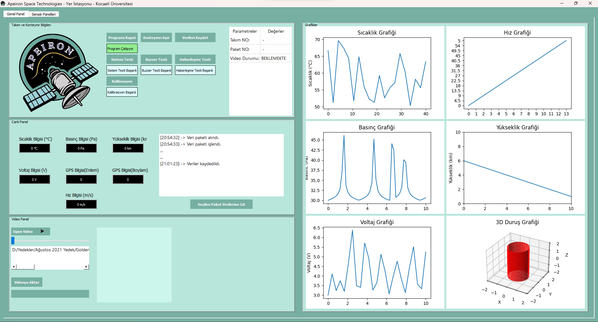

# APEIRON SPACE TECHNOLOGIES STUDENT CLUB - TÜRKSAT Model Uydu Yarışması 2020 Yer İstasyonu Arayüz Tasarımı

## Herkese Selamlar

Bu proje, TÜRKSAT Model Uydu Yarışması 2020 için hazırlamış olduğumuz model uydunun yer istasyonu için hazırlamış olduğum arayüz tasarımıdır. 

## İçindekiler

0. [Herkese Selamlar](#herkese-selamlar)
1. [Uygulama Hakkında](#uygulama-hakkında)
2. [Gerekli Kütüphaneler](#gerekli-kütüphaneler)
3. [Önemli Notlar](#önemli-notlar)

## Uygulama Hakkında

Arayüz tasarımı 2 kısımdan oluşuyor. Birinci kısımda takım ve konteynır bilgilerinin, canlı panelin, canlı kamera görüntüsünün ve canlı grafiklerin bulunduğu "Genel Panel"dir.

Model uydunun sensörlerinden alınan "sıcaklık, basınç, yükseklik, voltaj, GPS(Enlem/Boylam), Hız" bilgileri paket halinde çekilir. Bu bilgiler canlı panelde ve zamana bağlı grafiklerde gösterilir. Ayrıca Model uyduda bulunan kamera görüntüleri sol alt kısımda gösterilir ve model uyduya geri video aktarılır.

Arayüz tasarımının ikinci kısmında ise model uydudan alınan verilerin detaylı olarak gösterimi ve grafik üzerinden seçilerek incelenmesi sağlanıyor.

## Gerekli Kütüphaneler

PyQt5

PyQtWebEngine

matplotlib

folium

numpy

## Önemli Notlar

Bu Projede:

	1. Arayüz tasarımının son düzenlemesi yapılmadı. Düzgün çalışmayan kısımlar bulunabilir.

	2. Veri aktarımı kurmuş olduğumuz haberleşme sistemine özel olarak hazırlandığı için gerçek veriler bu örnekte el ile kod içerisinde rastgele girilmiştir.

	3. Kamera görüntüsü kısmı, harici olarak video seçimi ile gösterimi olarak yer değiştirilmiştir.

Yer Kontrol
Arayüzü Python 3.5 dili ile yazılıp PyCharm Ortamında geliştirilmiştir.
